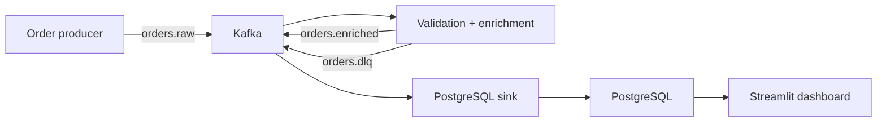

# Real-Time Retail Analytics Pipeline with Apache Kafka

A portfolio-ready data engineering project that generates retail order events, validates and transforms them in real time, stores clean records in PostgreSQL, routes bad records to a dead-letter topic, and displays business KPIs in Streamlit.

## Architecture



Kafka runs in KRaft mode, so this project does not require ZooKeeper.

## What this project demonstrates

- Kafka producers, topics, partitions, message keys, and consumer groups
- Real-time validation and transformation with Pydantic
- Dead-letter queue (DLQ) handling for invalid events
- Manual offset commits and idempotent PostgreSQL inserts
- Container health checks and service dependencies
- Live KPIs and charts built from processed streaming data
- Unit tests for the core business logic

## Project structure

```text
kafka-retail-pipeline/
├── docker-compose.yml
├── Dockerfile
├── Makefile
├── requirements.txt
├── sql/init.sql
├── src/
│   ├── common.py
│   ├── producer.py
│   ├── processor.py
│   ├── sink.py
│   ├── dashboard.py
│   └── send_bad_event.py
└── tests/test_common.py
```

## Prerequisites

- Docker Desktop 4.x or Docker Engine with Docker Compose v2
- At least 4 GB of free memory

You do not need to install Python, Kafka, Java, or PostgreSQL locally.

## Run the complete project

From this folder:

```bash
cp .env.example .env
docker compose up --build -d
docker compose ps
```

Open the live dashboard at [http://localhost:8501](http://localhost:8501).

The producer emits one event per second by default. Wait about 15 seconds, then refresh the dashboard if the first load is empty.

## Observe the pipeline

Follow all application logs:

```bash
docker compose logs -f producer processor sink
```

Inspect Kafka topics:

```bash
docker compose exec kafka /opt/kafka/bin/kafka-topics.sh \
  --bootstrap-server kafka:29092 --list
```

Read clean events:

```bash
docker compose exec kafka /opt/kafka/bin/kafka-console-consumer.sh \
  --bootstrap-server kafka:29092 \
  --topic orders.enriched \
  --from-beginning \
  --max-messages 5
```

Query PostgreSQL:

```bash
docker compose exec postgres psql -U kafka_user -d retail \
  -c "SELECT category, COUNT(*) AS orders, ROUND(SUM(net_amount), 2) AS revenue FROM orders GROUP BY category ORDER BY revenue DESC;"
```

## Test the dead-letter queue

Send one deliberately invalid event:

```bash
docker compose run --rm producer python -m src.send_bad_event
```

Read it from the DLQ:

```bash
docker compose exec kafka /opt/kafka/bin/kafka-console-consumer.sh \
  --bootstrap-server kafka:29092 \
  --topic orders.dlq \
  --from-beginning \
  --max-messages 1
```

## Run tests

```bash
docker compose run --rm --no-deps producer pytest -q
```

## Stop or reset

Stop services without deleting data:

```bash
docker compose down
```

Delete containers and the Kafka/PostgreSQL volumes, then start fresh:

```bash
docker compose down -v
```

The second command permanently removes this project's local data.

## Reliability choices

- Events are keyed by `customer_id`, preserving order for each customer within a partition.
- Kafka auto-commit is disabled. Each consumer commits only after its downstream action succeeds.
- The PostgreSQL table uses `event_id` as its primary key and `ON CONFLICT DO NOTHING`, making replayed events safe to store.
- Malformed JSON and records that fail schema validation are sent to `orders.dlq` with the error details and original payload.
- Kafka producers enable idempotence and `acks=all`.

This is an **at-least-once** pipeline. Database duplicates are prevented by the primary key, but strict end-to-end exactly-once delivery across Kafka and PostgreSQL would require a transactional outbox, Kafka Connect JDBC sink with suitable guarantees, or another coordinated transaction design.

## Useful experiments

1. Change `EVENT_INTERVAL_SECONDS` in `.env` to `0.1` and restart the producer.
2. Scale the processor to see consumer-group partition assignment:
   `docker compose up -d --scale processor=2`.
3. Stop the sink for 30 seconds, restart it, and observe Kafka buffering events.
4. Add a second dashboard KPI such as revenue per region or cancellation rate.
5. Replace the generator with events from an API, application, or CDC connector.

## Resume-ready description

> Built a containerized real-time retail analytics pipeline using Apache Kafka, Python, PostgreSQL, and Streamlit. Implemented partitioned event ingestion, schema validation, enrichment, dead-letter handling, manual offset management, idempotent database writes, automated testing, and live KPI visualization.

